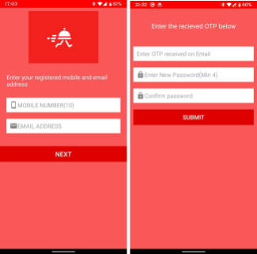

# FoodRunner App

A clone of Zomato integrated with Razorpay for seamless payment transactions. This app provides an intuitive and user-friendly food ordering experience.

## Software Requirements

- **Android Studio 4.0.1:** Main platform for app development.
- **FIGMA:** For designing and prototyping the user interface.
- **MongoDB Database:** Handles data storage on the server side.
- **Node.js:** Back-end programming language for API and server-side scripting.
- **Kotlin + XML:** Languages used for building the app's functionality and user interface.
- **VS CODE:** For developing Node.js files and server management.
- **Postman:** Essential for API testing and debugging.

## Client-Server Communication Model

## Entity-Relationship (ER) Diagram

## App Interface Screenshots

<table>
  <tr>
    <td> Splash Screen</td>
    <td> Login Screen</td>
    <td> Registration Screen</td>
  </tr>
  <tr>
    <td> Forgot Password Screen</td>
    <td> Navigation Drawer</td>
    <td> All Restaurants Screen</td>
  </tr>
  <tr>
    <td> Sort Filter Screen</td>
    <td> Restaurant Menu Screen</td>
    <td> Cart Screen</td>
  </tr>
  <tr>
    <td> Payment Gateway Screen</td>
    <td> Payment Gateway Screen (Cont.)</td>
    <td> Profile Screen</td>
  </tr>
  <tr>
    <td> Favourites Screen</td>
    <td> FAQ Screen</td>
    <td> Order History Screen</td>
  </tr>
  <tr>
    <td> Restaurants Registration Screen</td>
    <td> Logout Screen</td>
  </tr>
</table>
